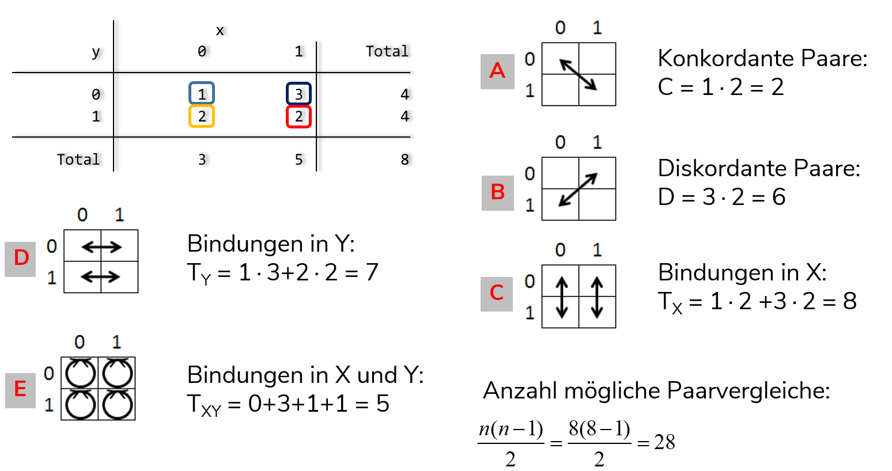

# Zusammenhangsmaße {#zshg} 

```{r setup8, echo = F, message=F, warning = F}
.libPaths("D:/R-library4")
knitr::opts_chunk$set(collapse = TRUE)
knitr::opts_chunk$set(dpi=800)
library(Statamarkdown)
library(tidyverse)
library(kableExtra)
# stataexe <- "C:/Program Files (x86)/Stata13/StataSE-64.exe"
stataexe <- "C:/Program Files/Stata16/StataSE-64.exe"
knitr::opts_chunk$set(engine.path=list(stata=stataexe))
options(width = 200)
df <- data.frame(var1 = c(1,2,7,8),
                 var2 = c(2,4,7,6))

# path <- "D:/oCloud/RFS/"
# ak <- readr::read_delim(paste0(path,"allbus_kumuliert_1980-2018.csv"), delim = ";", col_types = cols(.default = col_double())) %>%  
#   mutate_all(~ifelse(.<0,NA,.))
z_wert <-2.5804
```

Zusammenhänge sind das Herz (fast) aller statistischer Analysen. Im Folgenden lernen wir die Berechnung einer Reihe von Kennzahlen kennen, welche den Zusammenhang zwischen zwei Variablen ausdrücken. 

## `ttest` {#ttest}

Ausgangsszenario: wir betrachten ein Merkmal und möchten durch eine Stichprobe überprüfen, ob der Mittelwert mit unserer Vermutung übereinstimmt bzw. größer/kleiner ist. 
Dies leisten die Hypothesentests, sog. t-Tests. 
Testen wir auf Übereinstimmung, verwenden wir einen sog. beidseitigen Test, bei einem einseitigen Test testen wir ob der Stichprobenwert signifikant größer bzw. kleiner als der vermutete Populationswert ist.
Auch hier bleiben wir beim Durchschnittsalter der Erwerbstätigen - mit welcher Sicherheit können wir ausschließen, dass das Durchschnittsalter 47.4 Jahre ist?

+ beidseitiger Test
  + $H_0: \mu = 47.4\;Jahre$ und $H_A: \mu \neq 47.4\;Jahre$  
+ gerichtete Hypothesen:
  + rechtsseitiger Test  
  $H_0: \mu \leqslant 47.4\;Jahre$ und $H_A: \mu > 47.4\;Jahre$  
  $\Rightarrow$ die $H_A$ postuliert, dass der wahre Wert **größer** als der Wert aus der $H_0$ ist
  + linksseitiger Test  
  $H_0: \mu \geqslant 47.4\;Jahre$ und $H_A: \mu < 47.4\;Jahre$  
  $\Rightarrow$ die $H_A$ postuliert, dass der wahre Wert **kleiner** als der Wert aus der $H_0$ ist

Wir berechnen also, mit welcher Irrtumswahrscheinlichkeit wir die $H_0$ verwerfen können, von einem signifikanten Unterschied wird in der Regel gesprochen wenn die Irrtumswahrscheinlichkeit unter 5% liegt. Das bedeutet:

> *Assuming that the null hypothesis is true and the study is repeated an infinite number times by drawing random samples from the same populations(s), less than 5% of these results will be more extreme than the current result.*[^1]

[^1]: [Failing Grade: 89% of Introduction-to-Psychology Textbooks That Define or Explain Statistical Significance Do So Incorrectly. Advances in Methods and Practices in Psychological Science, 2515245919858072.](https://doi.org/10.1177/2515245919858072)


`ttest` berechnet immer die Ergebnisse für einen links-, beid- und rechtsseitigen t-Test.
Neben den zu testenden Werten geben wir mit `mu` den in der Nullhypothese festgehaltenen Mittelwert an:
```{stata ttest1a, eval = F}
ttest zpalter==47.4
```
```{stata ttest1b, echo = F}
set linesize 80
qui use "D:\Datenspeicher\BIBB_BAuA/BIBBBAuA_2018_suf1.0.dta", clear
qui mvdecode zpalter, mv(9999)
ttest zpalter==47.4
```

Der p-Wert unter `mean < 47.4` ist mit `r round(pt(q = -z_wert, df = 19836),4)` kleiner als 0,05, dementsprechend würden wir auf Basis eines linksseitigen Hypothesentests die $H_0$ verwerfen.

Das p-Wert unter `mean != 47.4` liegt also deutlich unter 0,05. Wir würden also die $H_0$ verwerfen, dass das Durchschnittsalter ür die Grundpopulation der Erwerbstätigen in D  gleich 47.4 Jahre ist.

Wir sehen unter `mean > 47.4`, dass der p-Wert `r round(pt(q = z_wert, df = 19836),4)` deutlich größer als 0,05 ist - dementsprechend würden wir auf Basis eines rechtsseitigen Hypothesentests die $H_0$ nicht verwerfen.

## Mittelwertvergleiche mit dem t-Test {#mittelwertttest}

Diese Testlogik können wir auch dazu verwenden, Kennzahlen für verschiedene Gruppen zu vergleichen. 

### Unverbundener t-Test
Eine häufige Frage zielt darauf ab zu analysieren, ob sich die Durchschnittswerte eines Merkmals zwischen zwei Gruppen unterscheiden.
Beispielsweise könnten wir das Durchschnittsalter zwischen erwerbstätigen Männern und Frauen vergleichen.

Auch für Gruppenvergleich müssen zunächst Hypothesen aufgestellt werden. 

+ Für einen beidseitigen Test ist die Alternativhypothese, dass es einen Gruppenunterschied gibt:  

    $H_0: \mu_1 - \mu_2 = 0 \qquad H_A: \mu_1 - \mu_2 \neq 0$
 
+ Ein linksseitiger Test hätte entsprechend die Alternativhypothese, dass der Gruppenunterschied *kleiner* als 0 ist:  

    $H_0: \mu_1 - \mu_2 \geqslant 0 \qquad H_A: \mu_1 - \mu_2 < 0$

+ Ein rechtssseitiger Test hätte entsprechend die Alternativhypothese, dass der Gruppenunterschied *größer* als 0 ist:  

    $H_0: \mu_1 - \mu_2 \leqslant 0 \qquad H_A: \mu_1 - \mu_2 > 0$


Wenn wir nun die beiden Mittelwerte für Männer und Frauen vergleichen, greifen wieder auf den `ttest` zurück, aber hier geben wir anstelle von `== XYZ` mit `by(sex)` die Gruppenvariable an. Mit `unequal` lassen wir zudem zu, dass die Varianz des Alters in beiden Gruppen unterschiedlich ist (was sehr häufig der Fall ist):
```{stata ttest6, eval = F}
ttest zpalter, by(S1) unequal
```
```{stata ttest6b, echo=F}
set linesize 80
qui use "D:\Datenspeicher\BIBB_BAuA/BIBBBAuA_2018_suf1.0.dta", clear
qui mvdecode zpalter, mv(9999)
ttest zpalter, by(S1) unequal
```

Für die jeweiligen Tests ergeben sich folgende Entscheidungen:

  + beidseitiger Test: Da der p-Wert für den beiseitigen Test (unter `Ha: diff != 0`) deutlich unter 0,05 liegt, können wir hier die $H_0$ verwerfen und gehen von signifikanten Altersunterschieden aus.  
  + rechtsseitiger Test: für einen rechtsseitigen Test achten wir auf `Ha: diff > 0`- die erwerbstätigen Männer sind also nicht signifikant *älter* als die erwerbstätigen Frauen.
 + linksseitiger Test: für einen linksseitigen Test ist hingegen `Ha: diff < 0` ausschlaggebend: erwerbstätigen Männer sind also signifikant *jünger* als erwerbstätige Frauen.

***

[**Übung**](#tgroup)

***

### Verbundener t-Test

Möchten wir Werte vergleichen, welche in einer Verbindung zueinander stehen, ist der verbundene t-Test die richtige Wahl. Beispiele für verbundene Stichproben sind beispielsweise experimentelle Untersuchungen, welche Daten vor und nach einer Maßnahme/Treatment/Intervention messen. Anschließend soll anhand des Vergleichs der Ergebnisse und die Wirkung der Maßnahme evaluiert werden. Hier sind die Messwerte aus den beiden Gruppen ("vorher" und "nachher") miteinander *verbunden* - bspw. wird eine Person mit Bluthochdruck auch nach der Maßnahme in der Tendenz einen höheren Blutdruck haben als eine Person, welche bereits zuvor einen niedrigeren Blutdruck hatte.

Ein fiktionales Beispiel:

```{stata , eval = F}
webuse bpwide
browse bp_before bp_after 
```


```{r bpwide_shot, echo = F,out.width = "60%",out.height="60%", fig.align="center"}
knitr::include_graphics("./pics/07_bpwide.png")
```

Diese vorher/nachher Werte können wir jetzt mit einem verbundenen t-Test vergleichen:
```{stata, eval = F}
ttest bp_before==bp_after
```

```{stata, echo = F}
set linesize 200
qui clear
qui webuse bpwide,clear
ttest bp_before==bp_after
```

Auch hier sehen wir wieder die Ergebnisse für einen links- (` Ha: mean(diff) < 0 `) beid- (`Ha: mean(diff) != 0`) und rechtsseitigen (`Ha: mean(diff) > 0`) Test. Wir erkennen aus den Ergebnissen, dass der Blutdruck der Patient\*innen:

  + nach dem Treatment nicht signifikant höher ist - linksseitiger Test (*bp_before < bp_after*), linke Spalte
  + sich vor und nach dem Treatment signifikant unterscheidet - beiseitiger Test (*bp_before != bp_after*), mittlere Spalte
  + nach dem Treatment signifikant niedriger ist - rechtsseitiger Test (*bp_before > bp_after*), rechte Spalte

    


## Übersicht zu Varianten für `ttest`

Für alle `ttest`-Varianten können wir mit `, level(..)` auch ein anderes Signifikanzniveau wählen. Standardmäßig wird $\alpha=0,05\%$ verwendet.

+ Vergleich zu einem Referenzwert: `ttest testvariable == referenzwert`

Für Mittelwertvergleich gibt es insgesamt zwei Aspekte, anhand derer sich t-Tests unterscheiden:

+ Die Varianz der Messwerte in den verglichenen Gruppen ist ...
  + gleich: $\Rightarrow$ `ttest testvariable, by(gruppenvariable)` 
  + verschieden: $\Rightarrow$ `ttest testvariable, by(gruppenvariable) unequal` (wie oben)
  
+ Verbundene oder unverbundene Stichprobe?
  + Sind die einzelnen Messwerte voneinander unabhängig? D.h. ein Messwert steht in keinem direkten Zusammenhang mit einem anderen $\Rightarrow$ `ttest testvariable, by(gruppenvariable)` für eine unverbundene Stichprobe (mit ggf. `unequal`)
  + Stehen die einzelnen Messwerte in einem Zusammenhang? D.h. ein Messwert steht in einem direkten Zusammenhang mit einem anderen
    $\Rightarrow$ Werte für beide Variablen sollten "nebeneinander" abgelegt sein (*wide*-Format), dann kann mit `ttest vorher==nachher` ein verbundener `ttest` durchgeführt werden.


## Korrelationskoeffizienten {#cor}


### Korrelation {#pearson}

Zur Bestimmung eines Zusammenhangs zwischen zwei metrischen Variablen empfiehlt sich der Pearson-Korrelationskoeffizient:
$$r = \frac{\frac{1}{n}\Sigma_{i}^{n}(x_i-\bar{x})(y_i-\bar{y})}{\sqrt{\frac{1}{n}\Sigma_{i}^{n}(x_i-\bar{x})^2} \times \sqrt{\frac{1}{n}\Sigma_{i}^{n} (y_i-\bar{y})^2}} = \frac{cov_{xy}}{s_x \times s_y}$$
In Stata können wir den Korrelationskoeffizienten mit `pwcorr` berechnen. Mit der Option `,sig` werden zudem die p-Werte ausgegeben:
```{stata corr1,eval=F}
pwcorr zpalter F231, sig
```
```{stata corr1b, echo =F}
set linesize 90
qui use "D:\Datenspeicher\BIBB_BAuA/BIBBBAuA_2018_suf1.0.dta", clear
qui mvdecode zpalter, mv(9999)
qui replace F231 =  . if F231 > 99
pwcorr zpalter F231, sig
```

Es handelt sich mit `0.0548` also um einen geringen Zusammenhang. Der p-Wert gibt uns auch hier wieder Auskunft über die stat. Signifikanz: mit `0.0003` liegt der p-Wert deutlich unter 0,05 $\Rightarrow$ wir würden hier die Nullhypothese verwerfen, dass die Korrelation in der Grundpopulation gleich Null ist. 

Um die Korrelationsmatrix zu erweitern, würden wir einfach zusätzliche Variablen angeben: 
```{stata corrm, eval = F}
pwcorr zpalter F231  F200 F1408, sig
```

```{stata corrmb, echo =F}
set linesize 200
qui use "D:\Datenspeicher\BIBB_BAuA/BIBBBAuA_2018_suf1.0.dta", clear
qui mvdecode zpalter, mv(9999)
qui replace F231 =  . if F231 > 99
qui mvdecode F200 F1408, mv( 97/99)
pwcorr zpalter F231 F200 F1408, sig
```

### Rangkorrelation {#spearman}


Zur Bestimmung der nicht-linearen Korrelation bzw. der Korrelation von ordinalen Merkmalen empfiehlt sich der Spearman-Rangkorrelationskoeffizient ($\rho$).

Wir können den Rangkorrelationskoeffizienten mit `spearman` berechnen:
```{stata spearmF, eval = F}
spearman zpalter F231
```

```{stata spearmT, echo = F}
quietly{
set linesize 120
qui use "D:\Datenspeicher\BIBB_BAuA/BIBBBAuA_2018_suf1.0.dta", clear
	replace F231 =  . if F231 > 99
	mvdecode zpalter, mv(9999)
}
spearman zpalter F231
```
          
Es zeigt sich also mit einem Korrelationskoeffizienten von 0.05 ein schwacher, positiver Zusammenhang. 
Für eine Korrelationsmatrix mit Rangkorrelationskoeffizienten müssen wir aber einen kleinen Umweg gehen und mit Hilfe von `egen` die Werte in Ränge umrechnen, um dann `pwcorr` verwenden zu können.

<!-- ```{stata rcorrm, eval = F} -->
<!-- egen zpalter_rnk = rank(zpalter) , unique -->
<!-- egen F231_rnk    = rank(F231)    , unique -->
<!-- egen F200_rnk    = rank(F200)    , unique -->
<!-- egen F1408_rnk   = rank(F1408)   , unique -->

<!-- pwcorr zpalter_rnk F231_rnk  F200_rnk F1408_rnk, sig -->
<!-- pwcorr zpalter F231 F200 F1408, sig // zum Vergleich -->
<!-- ``` -->

<!-- ```{stata rcorr1b, echo =F} -->
<!-- quietly{ -->
<!-- set linesize 100 -->
<!-- qui use "D:\Datenspeicher\BIBB_BAuA/BIBBBAuA_2018_suf1.0.dta", clear -->
<!--    mvdecode zpalter, mv(9999) -->
<!--    replace F231 =  . if F231 > 99 -->
<!--    mvdecode F200 F1408, mv( 97/99) -->

<!--    foreach v of varlist zpalter F231 F200 F1408 { -->
<!-- 	    egen `v'_rnk = rank (`v'), unique -->
<!--     } -->
<!-- } -->
<!-- pwcorr zpalter_rnk F231_rnk  F200_rnk F1408_rnk, sig -->
<!-- dis "zum Vergleich Pearson-Korrelationskoeffizient" -->
<!-- pwcorr zpalter F231 F200 F1408, sig -->
<!-- ``` -->

<!-- Eine Abkürzung für die Umrechnung [hier](#foreach) -->

## Tabellenbasierte Zusammenhangsmaße       
   
Ein klassisches ordinales Merkmal ist die Schulbildung, die wir aus `S3` zusammenfassen können (Details im DoFile):
Wir sehen uns den (möglichen) Zusammenhang zwischen der Schulbildung und `F600_12` an:

```{r ord_vars, echo =F}
tribble(~"v",~"l",
        "educ", "höchster Schulabschluss",
          "1" , "max. Hauptschulabschluss",
          "2" , "max. mittlere Reife",
          "3" , "(Fach-)Abitur",
          "F600_12", "Häufigkeit: unter Lärm arbeiten",
          "1" , "häufig",
          "2" , "manchmal",
          "3" , "selten",
          "4" , "nie"
        ) %>% 
    kable() %>% 
  kable_styling(bootstrap_options = "condensed", full_width = F,font_size = 10) %>% 
  column_spec(1,monospace = TRUE) %>% 
  row_spec(c(1,5), bold = T, background = "#F2F2F2FF") %>% 
    row_spec(0, color = "white")
```

            
So sieht die Verteilung zunächst in einer Kreuztabelle aus:
```{stata tabF, eval = F}
tab F600_12 educ
```
          
```{stata tabT, echo = F}
quietly{
set linesize 120
qui use "D:\Datenspeicher\BIBB_BAuA/BIBBBAuA_2018_suf1.0.dta", clear
	mvdecode S3, mv(1 10/12 99)
	cap drop educ
	recode S3 (2/4 = 1 "Haupt")(5/6 = 2 "m. Reife") (7/9 = 3 "(Fach-)Abi"), into(educ)
	mvdecode F600_12, mv(9)
	lab var educ "educ"
}
tab F600_12 educ // finale Tabelle
```
          
          
### Konkordanzmaße {#tau}
          
          
```{stata tabKTF, eval = F}
tab educ mi02
```

```{stata tabKTT, echo = F}
quietly{
set linesize 120
qui use "D:\Datenspeicher\BIBB_BAuA/BIBBBAuA_2018_suf1.0.dta", clear
	mvdecode S3, mv(1 10/12 99)
	cap drop educ
	recode S3 (2/4 = 1 "Haupt")(5/6 = 2 "m. Reife") (7/9 = 3 "(Fach-)Abi"), into(educ)
	mvdecode F600_12, mv(9)
	lab var educ "educ"
}
tab educ F600_12
```


Zur Berechnung in Stata können wir `ktau` verwenden:
```{stata tauF, eval = F}
ktau  educ F600_12
```
```{stata tauT, echo = F}
quietly{
set linesize 120
qui use "D:\Datenspeicher\BIBB_BAuA/BIBBBAuA_2018_suf1.0.dta", clear
	mvdecode S3, mv(1 10/12 99)
	cap drop educ
	recode S3 (2/4 = 1 "Haupt")(5/6 = 2 "m. Reife") (7/9 = 3 "(Fach-)Abi"), into(educ)
	mvdecode F600_12, mv(9)
	lab var educ "educ"
}
ktau  educ F600_12
```
Das positive Vorzeichen des Zusammenhangs deutet darauf hin, dass mit einer höheren Ausprägung von `educ` tendenziell höhere Werte für  `F600_12` einher gehen: eine höhere Schulbildung geht mit einem höheren Wert in `F600_12` einher. 
Da höhere Werte in `F600_12` seltenere Belastung angeben sind also Befragte mit höherer Schulbildung seltener von Lärm belastet.
Der Wert von Kendall's $\tau_a$ ist deutlich niedriger als von Kendall's $\tau_b$, da hier der Nenner durch die Berücksichtigung *aller* möglichen Paarvergleiche größer wird, der Zähler aber für beide Varianten von Kendall's $\tau$ gleich definiert ist. 

Ein weiteres Maß ist Goodman & Kruskal's $\gamma$, dieses bekommen wir mit der Option `,gamma` in `tab`:
```{stata tauG, eval = F}
tab educ F600_12, gamma
```
```{stata tauG2, echo = F}
quietly{
set linesize 120
qui use "D:\Datenspeicher\BIBB_BAuA/BIBBBAuA_2018_suf1.0.dta", clear
	mvdecode S3, mv(1 10/12 99)
	cap drop educ
	recode S3 (2/4 = 1 "Haupt")(5/6 = 2 "m. Reife") (7/9 = 3 "(Fach-)Abi"), into(educ)
	mvdecode F600_12, mv(9)
	lab var educ "educ"
}
tab educ F600_12, gamma
```

Auch Goodman & Kruskal's $\gamma$ deutet auf einen negativen Zusammenhang hin, hier ist die Stärke mit (`-0.5065`) aber deutlich höher. Dies ist auf die Berücksichtigung der Bindungen zurückzuführen: hier werden alle Bindungen ausgeschlossen, also auch Paarvergleiche mit Bindungen nur auf  einer Variable. Es reduziert sich also der Nenner, somit ergibt sich im Ergebnis ein höherer Koeffizient für Goodman & Kruskal's $\gamma$ als für Kendall's $\tau_b$. 

### Chi² & Cramér's V {#chi2}

$\chi^2$  basiert auf dem Vergleich der beobachteten Häufigkeit mit einer (theoretischen) Verteilung, welche statistische Unabhängigkeit abbildet (Indifferenztabelle - [mehr dazu](#indiff)). Wir bleiben bei `aq03` und `dh01`. Den $\chi^2$-Wert für diese Häufigkeitstabelle bekommen wir mit `, chi2`:
Mit der Option `, V` bekommen wir auch Cramér's V ausgegeben:
```{r, echo=F, warning=F}
baua <- readstata13::read.dta13("D:/Datenspeicher/BIBB_BAuA/BIBBBAuA_2018_suf1.0.dta",convert.factors = F,
                                select.cols = c("S1","F204")) 
tab1 <- xtabs(~ F204 + S1, data = baua %>% select(S1,F204) %>% filter(F204<9))
tx <- chisq.test(tab1)
```

```{stata chitabF, eval =F}
tab F204 S1, chi V
```
```{stata chitabT, echo =F}
quietly{
set linesize 120
qui use "D:\Datenspeicher\BIBB_BAuA/BIBBBAuA_2018_suf1.0.dta", clear
	recode S3 (2/4 = 1 "Haupt")(5/6 = 2 "m. Reife") (7/9 = 3 "(Fach-)Abi"), into(educ)
	mvdecode F204, mv(9)
}
tab F204 S1, chi wrap V
```

Auf Basis dieses $\chi^2$-Werts  können wir Cramér's V berechnen. Dieses ist definiert als der Quotient aus dem $\chi^2$-Wert und der Fallzahl multipliziert mit dem Minimum der Zeilen- und Spaltenzahl. `n`, erkennen wir aus dem `Total` rechts unten in der Tabelle. Außerdem hat unsere Tabelle 2 Zeilen und 4 Spalten, dementsprechend entspricht das Minimum hier 2:

$$ Cramer's\,\,V = \sqrt{\frac{\chi^2}{n \times min(k-1,m-1)}}=\sqrt{\frac{225.4461}{9359\times(2-1)}} = 0.1552$$
            
***

**[Übung](#met_ord)**

***

## Übungen 

Laden Sie die Erwerbstätigenbefragung in Stata. 

### Übung {#tvsmu}

(@) Testen Sie die Hypothese, dass die eigentliche durchschnittliche Arbeitszeit 38.5 Stunden beträgt. 

### Übung {#tgroup}

(@) Testen Sie die Hypothese, dass ein signifikanter Unterschied in der Arbeitszeit (`az`) zwischen Männern und Frauen besteht (`S1`)


### Übung {#met_ord}

(@) Untersuchen Sie den Zusammenhang zwischen der Wochenarbeitszeit (`az`) und dem Einkommen (`F518_SUF`) der Befragten. Welches Maß ist das richtige?
  + Denken Sie daran, die Missings in `F518_SUF` auszuschließen: `mvdecode F518_SUF, mv(99998/99999)`, `az` hat keine Missings.

(@) Untersuchen Sie den Zusammenhang zwischen der Häufigkeit von starkem Termin- oder Leistungsdruck `F411_01` und der dreistufigen Schulbildungsvariable `educ`.
  + So können Sie `educ` erstellen:   
```{stata, eval =F}
recode S3 (2/4 = 1 "Haupt")(5/6 = 2 "mittlere Reife") (7/9 = 3 "(Fach-)Abi") (else = .), into(educ)
```
  + Denken Sie daran, die Missings in `F411_01` zu überschreiben: `mvdecode F411_01, mv(9)`
  + Berechnen Sie ein oder mehrere geeignete Zusammenhangsmaße für diese beiden Variablen.

## Anhang

### Indifferenztabelle {#indiff}

[$\chi^2$](#chi2) ergibt sich aus der Differenz zwischen der Indifferenztabelle und den beobachteten Häufigkeiten. Die Indifferenztabelle können wir mit `,expected` aufrufen (mit `nofreq` blenden wir die tatsächlichen Häufigkeiten aus):
```{stata indtabF, eval =F}
tab F204 S1, expected nofreq
```
```{stata indtabT, echo =F}
quietly{
set linesize 120
qui use "D:\Datenspeicher\BIBB_BAuA/BIBBBAuA_2018_suf1.0.dta", clear
	recode S3 (2/4 = 1 "Haupt")(5/6 = 2 "m. Reife") (7/9 = 3 "(Fach-)Abi"), into(educ)
	mvdecode F204, mv(9)
	lab var F204 "F204"
}
tab F204 S1, expected nofreq
```

### Konkordanzmaße

Für Konkordanzmaße wie Kendall's $\tau$ werden die Werteverhältnisse bzw. Paarvergleiche gezählt.
Die Idee ist, dass aus den Tabellenwerten Paarvergleiche gebildet werden können:
```{r paarvgl, echo = F,out.width = "90%",fig.height= 2, fig.align="center"}

```

+ $\tau_a$: Differenz der konkordaten (C) und diskordanten (D) Paarvergleiche als Anteil an allen möglichen Paarvergleichen $\frac{n\times(n-1)}{2}$: 

$$\tau_a=\frac{C-D}{\frac{n\times(n-1)}{2}}$$
  Nachteil: Bei Bindungen in X u. Y Maximalwerte (-1; +1) nicht zu erreichen


+ $\tau_b$: Differenz der konkordaten (C) und diskordanten (D) Paarvergleiche als Anteil an allen möglichen Paarvergleichen $\frac{n\times(n-1)}{2}$ *unter Ausschluss von Bindungen in X und Y* 

$$\tau_{b}=\frac{C-D}{\sqrt{(C+D+T_x)\times(C+D+T_y)}}$$
  Nachteil: Bei Bindungen in X o. Y Maximalwerte (-1; +1) nicht zu erreichen

+ Goodman & Kruskal's $\gamma$ ignoriert die Bindungen vollständig:
            
$$\gamma=\frac{C-D}{C+D}$$
            

