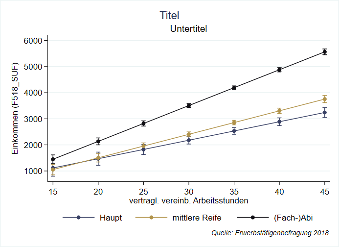

--- 
title: "Stata Einführung am BIBB"
author: "Andreas Filser"
date: "`r Sys.Date()`"
site: bookdown::bookdown_site
documentclass: book
bibliography: [book.bib, packages.bib]
biblio-style: apalike
link-citations: yes
description: "This site has been creating using the bookdown R package."
---

```{r setup, echo = F, message=F, warning = F}
if(Sys.getenv("USERNAME") == "filse" ) .libPaths("D:/R-library4")  # set library
list.of.packages <- c("tidyr","dplyr","readr","haven","rmarkdown","bookdown","devtools","tidyverse","knitr") # Pakete eintragen
new.packages <- list.of.packages[!(list.of.packages %in% installed.packages()[,"Package"])]
if(length(new.packages)) install.packages(new.packages)
knitr::opts_chunk$set(collapse = TRUE)
knitr::opts_chunk$set(echo = T)
# knitr::opts_chunk$set(dpi=400)
# devtools::install_github("hemken/Statamarkdown")
# stataexe <- "C:/Program Files (x86)/Stata13/StataSE-64.exe"
stataexe <- "C:/Program Files/Stata16/StataSE-64.exe"
knitr::opts_chunk$set(engine.path=list(stata=stataexe))
library(Statamarkdown)
library(tidyverse)
library(ggthemes)
```

# Herzlich Willkommen {-}


**Hier entsteht das Begleitskript für die Stata-Weiterbildung am BIBB von Andreas Filser am 15.12.2021.** 


```{r index_illustration, echo = F,out.width = "80%",fig.height= 3.5, fig.align="center"}

```


```{r include=FALSE}
# automatically create a bib database for R packages
knitr::write_bib(c(
  .packages(), 'bookdown', 'knitr', 'rmarkdown'
), 'packages.bib')
```
